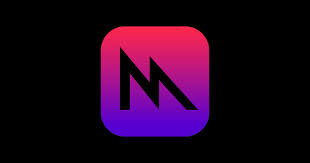

<p align=center>



</p>


# MandelbrotGPU: High-Precision GPU Mandelbrot Visualizer for macOS

MandelbrotGPU is an interactive, high-resolution Mandelbrot set visualizer built with Swift, Metal, and MetalKit. It features real-time GPU rendering, buttery-smooth zoom and pan, and the ability to generate ultra-high-resolution fractal imagery — including **16K** exports.

## Features

- **Real-time GPU Compute Shader Rendering** via Metal
- **Output Up to 16K Resolution (15360 × 8640)** for export or display

## Example Render
<p align="center">
  
</p>

## Getting Started

### Requirements

- macOS 13+ with Apple Silicon (M1/M2/M3/M4)
- Xcode 15+
- Swift + Metal

### Build Instructions

1. Clone the repo
2. Open in Xcode
3. Run the macOS app target
4. Scroll to zoom, click and drag to pan

### Recommended Settings

- Run on an Apple Silicon Mac with a Retina display
- Default output texture is 7680×4320 (4× supersampled 1080p)
- Supports up to **16K Mandelbrot rendering** — adjust `targetSize` in `MandelbrotRenderer.swift`

```swift
let targetSize = MTLSize(width: 15360, height: 8640, depth: 1)
```
